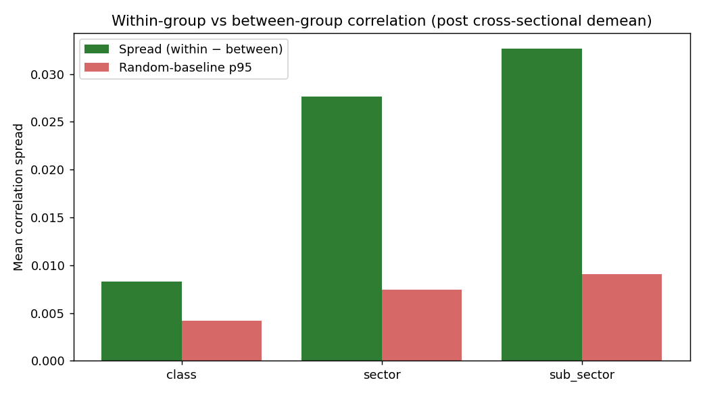
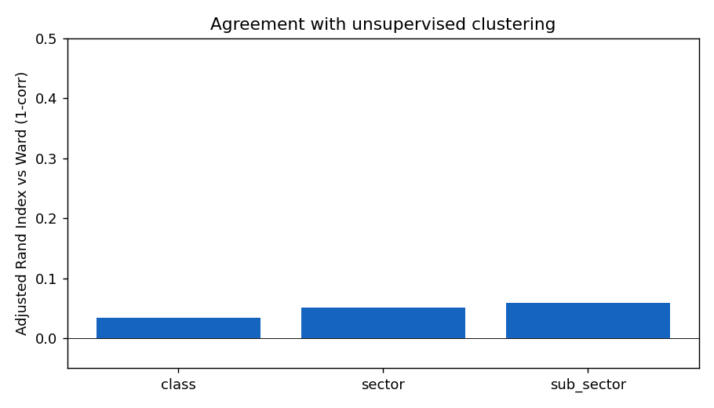
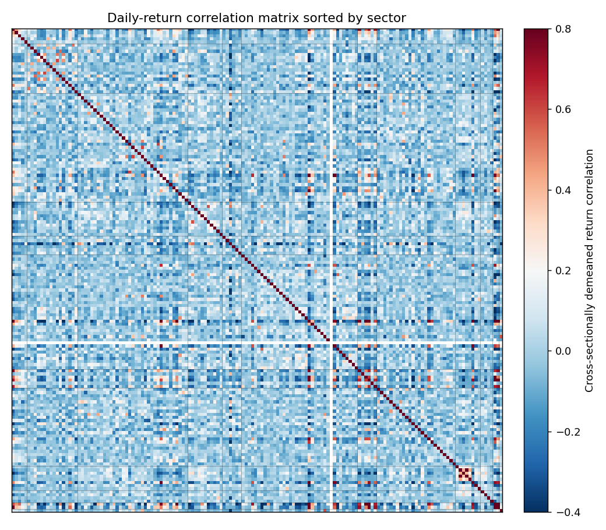

# Validation

> Numbers and charts on this page are regenerated by [`scripts/compute_validation.py`](scripts/compute_validation.py) on every release. Latest run: 2026-05-23, on 156 assets × 730 trading days.

## The one claim

**Same-sector assets co-move more on daily returns than cross-sector assets, at every level of the hierarchy, by a margin well above the random-permutation baseline.**

That is the entire empirical case for this taxonomy. If it failed, the classification would not be useful for sector neutralization or peer comparison.

## How it is measured

For each asset pair, we compute the daily-return correlation **after cross-sectional demeaning** (subtracting each day's universe mean from each asset's return). This removes the market beta — what is left is residual co-movement that a sector classification ought to explain.

For each level of the hierarchy, we compute:

- **Within-group mean correlation** — average pairwise correlation among assets in the same group
- **Between-group mean correlation** — average pairwise correlation across different groups
- **Spread** = within − between (the headline number)
- **Random baseline** = the 95th percentile of the spread distribution under label permutation (a null where the assignment is destroyed but group sizes are preserved)

A scheme **passes** if its spread is greater than the random-baseline 95th percentile.

## Results



| Level | Within | Between | Spread | Random p95 | Pass | n groups |
|---|---:|---:|---:|---:|:---:|---:|
| Class | −0.003 | −0.012 | **+0.008** | +0.004 | ✓ | 4 |
| Sector | +0.015 | −0.012 | **+0.028** | +0.007 | ✓ | 12 |
| Sub-sector | +0.022 | −0.011 | **+0.033** | +0.009 | ✓ | 33 |

Spread increases monotonically from Class → Sector → Sub-sector. Each level adds discriminative power beyond the level above it. All three pass the random-baseline test by 2-4x.

## Agreement with unsupervised clustering

A second sanity check: how much does our (theory-driven) classification agree with what an unsupervised Ward-linkage clustering on `√(2(1-ρ))` distance would produce at the same number of clusters? We measure agreement with the [Adjusted Rand Index](https://en.wikipedia.org/wiki/Rand_index#Adjusted_Rand_index) (chance-corrected; 0 = random, 1 = identical).



| Level | k | ARI vs Ward |
|---|---:|---:|
| Class | 4 | +0.035 |
| Sector | 12 | +0.051 |
| Sub-sector | 33 | +0.059 |

ARI is **positive but modest**. This is the expected outcome and is itself informative:

- Positive means our taxonomy is not random — it recovers some of the structure that an unsupervised method would find.
- Modest means our taxonomy is **not** what an unsupervised method would produce. That is intentional. USDT and USDC are in the same sub-sector because they are both fiat-backed stablecoins (theory). Their daily-return correlation is low because depeg events are rare and uncorrelated; an unsupervised method would place them in different clusters. We accept that loss because the *economic function* grouping is the one that supports portfolio reasoning ("how exposed am I to fiat-backed stablecoins?") and risk constraints.

A classification that achieves ARI = 1.0 against unsupervised clustering would be a *re-derivation* of the correlation structure, not a classification — and it would have no defensible answer to the USDT-USDC case.

## Correlation heatmap, sorted by sector

The clearest visual sanity check. Rows and columns are assets, sorted so that sector boundaries are contiguous. Diagonal blocks correspond to within-sector pairs (should be darker red); off-diagonal cells correspond to between-sector pairs (should be lighter).



The block structure is visible but imperfect — exactly what we would expect for an N=156 universe with high cross-asset comovement and a taxonomy that prioritizes economic interpretability over pure correlation tightness.

## What is not in scope here

- **Out-of-sample stability** — the classification rarely changes (most assets keep their sub-sector across years), so the validation is essentially a single in-sample measurement. We do not claim OOS predictive performance.
- **Causal claims** — same-sector co-movement is consistent with a shared exposure to economic primitives, but it is not direct evidence of one.
- **Statistical significance with formal multiple-testing correction** — given the small number of headline tests (3) and the wide gap between observed spread and random p95, formal correction would not change the conclusion. We omit it for clarity.

## How to reproduce

```bash
pip install -r requirements.txt
python scripts/compute_validation.py
```

Output goes to `validation/charts/` and `validation/numbers.json`. Run completes in under 30 seconds on a laptop.
